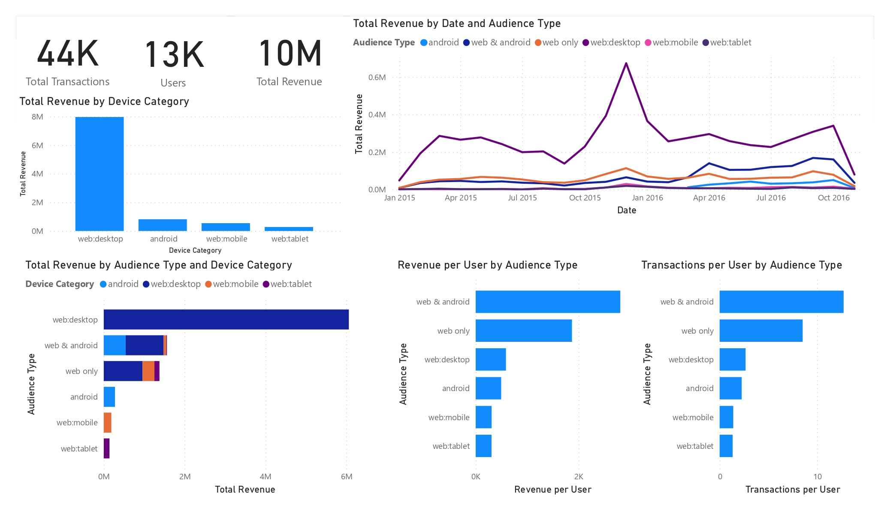

# Cross Device Analysis

This project involves the analysis of data across multiple devices to understand patterns, relationships, and anomalies.

## Overview

The [`cross_device_analysis.ipynb`](https://github.com/VangelisChocholis/Cross_Device_Analysis/blob/main/cross_device_analysis.ipynb) notebook contains the entire workflow of the analysis, from data loading and cleaning to exploratory data analysis (EDA), data analysis, and visualization of results.

## Results

The analysis in the notebook provides insights into data across multiple devices, with visualizations and detailed explanations about selecting suitable perfomance indicators. The summarized results are shown in the following Power BI dashboard below.

## Acknowledgments
I want to thank [Margera](https://www.margera.co) Data Analytics Agency for providing me the data.
